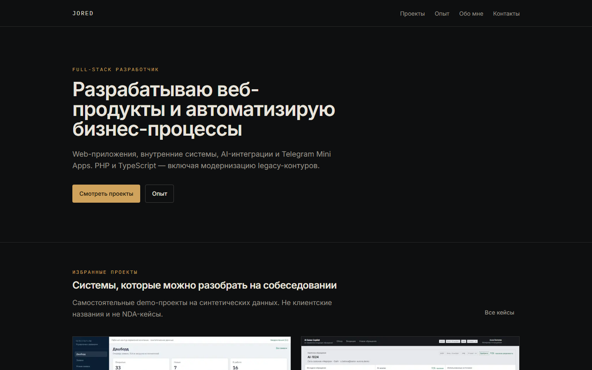

# Portfolio

Personal public site for engineering cases: web applications, internal systems, AI pipelines, Telegram Mini Apps, and PHP modernization.

This repository is the **site only**. Demo applications live in separate repositories. Company names, users and operational data on the pages are synthetic.



## Engineering highlights

- Case data drives featured order, not a hardcoded homepage list
- Production builds fail fast without `NEXT_PUBLIC_SITE_URL` (no localhost baked into canonical / OG / JSON-LD)
- Live Demo and GitHub blocks appear only when URLs exist
- Localhost demo links stay development-only
- Empty contact env values hide contact UI instead of inventing placeholders

## Stack

Next.js 16 · TypeScript · Tailwind CSS 4 · Vitest

## Run locally

Node.js 20+.

```bash
cp .env.example .env.local
npm install
npm run dev
```

Open http://localhost:3000

Leave `NEXT_PUBLIC_SITE_URL` empty in development. The site falls back to `http://localhost:3000`.

## Production build

`NEXT_PUBLIC_SITE_URL` is required and must be an absolute http(s) origin, not localhost:

```bash
NEXT_PUBLIC_SITE_URL=https://example.com npm run build
npm start
```

Optional public contacts (empty = hidden):

```
NEXT_PUBLIC_CONTACT_EMAIL=
NEXT_PUBLIC_CONTACT_TELEGRAM=
NEXT_PUBLIC_CONTACT_GITHUB=
```

## What the homepage shows

- **6 selected cases** — ServiceFlow, AI Sales Copilot, Legacy Upgrade, AutoFlow, BuildPro, GastroCity
- **2 experimental studies** — Nova One and Aurelia, labeled as studies, not flagships

The homepage does not print a “N public cases” count. The catalog length is derived from project data (currently 8 entries).

Nova One, Aurelia, BuildPro and GastroCity source trees are **not** in this repository. The site still presents their cases from local curated screenshots and copy.

## Tests

```bash
npm test
npm run lint
npm run typecheck
npm run build
```

For `npm run build` in CI, set `NEXT_PUBLIC_SITE_URL=https://example.com`.

## Limitations

- No live demo URLs and no GitHub project URLs until those repositories are published
- Contacts stay hidden until env values are set
- This is a personal portfolio site, not a client product
